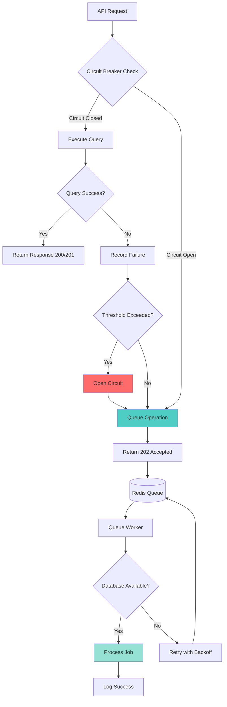

# Circuit Breaker and Queue Implementation Guide

This document explains the circuit breaker and message queue implementation in this Laravel project for handling database service failures.

## Overview

The project implements resilience patterns to handle database unavailability:
- **Circuit Breaker**: Detects database failures and fails fast to prevent cascading failures
- **Message Queue**: Buffers write operations when the database is unavailable
- **Automatic Retry**: Queue jobs retry with exponential backoff when database recovers

## Architecture



## Components

### 1. CircuitBreaker Service

Located at [`composer/app/Services/CircuitBreaker.php`](composer/app/Services/CircuitBreaker.php)

**Configuration:**
- `failureThreshold`: 5 failures before opening circuit
- `timeout`: 60 seconds before attempting recovery
- `successThreshold`: 2 successes to close circuit
- `monitoringWindow`: 120 seconds for counting failures

**States:**
- **Closed**: Normal operation, requests pass through
- **Open**: Fast fail, all requests are queued
- **Half-Open**: Testing recovery, limited requests allowed

### 2. DatabaseCircuitBreaker Service

Located at [`composer/app/Services/DatabaseCircuitBreaker.php`](composer/app/Services/DatabaseCircuitBreaker.php)

Wraps the CircuitBreaker specifically for database operations with:
- Connection testing before queries
- Failure threshold: 3 failures
- Timeout: 30 seconds
- Monitoring window: 60 seconds

### 3. Queue Jobs

Located in [`composer/app/Jobs/`](composer/app/Jobs/)

**User Operations:**
- `CreateUserJob` - Create new user
- `UpdateUserJob` - Update existing user
- `DeleteUserJob` - Delete user

**Product Operations:**
- `CreateProductJob` - Create new product
- `UpdateProductJob` - Update existing product
- `DeleteProductJob` - Delete product

**Job Configuration:**
- Max attempts: 5
- Backoff delays: 30s, 60s, 120s, 300s, 600s (exponential)
- Timeout: 60 seconds per attempt

### 4. Updated Controllers

**UserController** ([`composer/app/Http/Controllers/Api/UserController.php`](composer/app/Http/Controllers/Api/UserController.php))
**ProductController** ([`composer/app/Http/Controllers/Api/ProductController.php`](composer/app/Http/Controllers/Api/ProductController.php))

Both controllers now:
1. Inject `DatabaseCircuitBreaker` service
2. Check circuit breaker state before operations
3. Queue write operations if circuit is open
4. Return appropriate status codes

## Request/Response Flow

### Successful Operation (Circuit Closed)

**Request:**
```bash
curl -X POST http://localhost:8002/users \
  -H "Content-Type: application/json" \
  -d '{"name":"John Doe","email":"john@example.com","password":"Secret123!"}'
```

**Response (201 Created):**
```json
{
  "id": 1,
  "name": "John Doe",
  "email": "john@example.com",
  "created_at": "2026-02-14T10:00:00.000000Z",
  "updated_at": "2026-02-14T10:00:00.000000Z"
}
```

### Queued Operation (Circuit Open or Failed)

**Request:**
```bash
curl -X POST http://localhost:8002/users \
  -H "Content-Type: application/json" \
  -d '{"name":"Jane Doe","email":"jane@example.com","password":"Secret123!"}'
```

**Response (202 Accepted):**
```json
{
  "status": "queued",
  "message": "Database service is temporarily unavailable. Request has been queued.",
  "request_id": "550e8400-e29b-41d4-a716-446655440000",
  "circuit_state": "open"
}
```

### Read Operation with Circuit Open

**Request:**
```bash
curl http://localhost:8002/users
```

**Response (503 Service Unavailable):**
```json
{
  "error": "Database service is temporarily unavailable",
  "message": "Please try again later",
  "circuit_state": "open"
}
```

## Docker Services

The `docker-compose.yml` now includes:

### Redis Service
```yaml
redis:
  image: redis:7-alpine
  ports:
    - "6379:6379"
  healthcheck:
    test: ["CMD", "redis-cli", "ping"]
    interval: 5s
    timeout: 3s
    retries: 10
```

### Queue Worker Service
```yaml
queue-worker:
  build: .
  working_dir: /app
  command: php artisan queue:work redis --tries=5 --backoff=30,60,120,300,600
  environment:
    QUEUE_CONNECTION: redis
    REDIS_HOST: redis
  depends_on:
    - mysql
    - redis
  restart: unless-stopped
```

## Setup Instructions

### 1. Start Services

```bash
# Start all services including Redis and queue worker
docker compose -f docker-compose.yml -f docker-compose-kong.yml up -d
```

### 2. Configure Environment

Copy the environment configuration:
```bash
cd composer
cp .env.example .env
php artisan key:generate
```

The `.env` file should have:
```env
DB_CONNECTION=mysql
DB_HOST=mysql
DB_PORT=3306
DB_DATABASE=users_db
DB_USERNAME=root
DB_PASSWORD=

REDIS_HOST=redis
REDIS_PORT=6379
CACHE_DRIVER=redis
QUEUE_CONNECTION=redis
```

### 3. Run Migrations

```bash
docker compose exec api php artisan migrate --force
```

### 4. Verify Queue Worker

Check that the queue worker is running:
```bash
docker compose logs queue-worker
```

You should see:
```
[2026-02-14 10:00:00][INFO] Processing jobs from the [default] queue.
```

## Testing Circuit Breaker

### Test Scenario 1: Database Down

1. **Stop MySQL container:**
   ```bash
   docker compose stop mysql
   ```

2. **Make API requests** (will be queued):
   ```bash
   curl -X POST http://localhost:8002/users \
     -H "Content-Type: application/json" \
     -d '{"name":"Test User","email":"test@example.com","password":"Secret123!"}'
   ```

3. **Expected Response (202 Accepted):**
   ```json
   {
     "status": "queued",
     "message": "Database service is temporarily unavailable. Request has been queued.",
     "request_id": "...",
     "circuit_state": "open"
   }
   ```

4. **Start MySQL again:**
   ```bash
   docker compose start mysql
   ```

5. **Monitor queue worker logs:**
   ```bash
   docker compose logs -f queue-worker
   ```

   You'll see jobs being processed as database recovers.

### Test Scenario 2: Monitoring Circuit State

**Check logs for circuit breaker events:**
```bash
docker compose logs api | grep "Circuit breaker"
```

Expected log entries:
```
[2026-02-14 10:05:00] ERROR: Circuit breaker opened for database after 3 failures
[2026-02-14 10:06:00] INFO: Circuit breaker database moved to half-open state
[2026-02-14 10:06:15] INFO: Circuit breaker closed for database
```

## Monitoring Queue Status

### View Queued Jobs

**Check Redis for pending jobs:**
```bash
docker compose exec redis redis-cli

# Inside Redis CLI:
127.0.0.1:6379> KEYS queues:*
127.0.0.1:6379> LLEN queues:default
127.0.0.1:6379> LRANGE queues:default 0 -1
```

### Monitor Queue Worker

**View real-time processing:**
```bash
docker compose logs -f queue-worker
```

**View queue statistics:**
```bash
docker compose exec api php artisan queue:monitor redis
```

## Job Retry Behavior

When a job fails, it retries with exponential backoff:

| Attempt | Delay Before Retry |
|---------|-------------------|
| 1       | Immediate         |
| 2       | 30 seconds        |
| 3       | 60 seconds        |
| 4       | 120 seconds       |
| 5       | 300 seconds       |
| 6       | 600 seconds       |

After 5 failed attempts, the job is marked as permanently failed and logged.

## Troubleshooting

### Queue Worker Not Processing Jobs

**Check if worker is running:**
```bash
docker compose ps queue-worker
```

**Restart worker:**
```bash
docker compose restart queue-worker
```

**Check for errors:**
```bash
docker compose logs queue-worker --tail=50
```

### Circuit Breaker Stuck Open

**Reset circuit breaker** (in Laravel tinker):
```bash
docker compose exec api php artisan tinker

# Inside tinker:
$breaker = new App\Services\DatabaseCircuitBreaker();
$breaker->reset();
```

### Jobs Failing Permanently

**Check failed jobs:**
```bash
docker compose exec api php artisan queue:failed
```

**Retry failed jobs:**
```bash
docker compose exec api php artisan queue:retry all
```

**Clear failed jobs:**
```bash
docker compose exec api php artisan queue:flush
```

### Redis Connection Issues

**Test Redis connection:**
```bash
docker compose exec api php artisan tinker

# Inside tinker:
Cache::put('test', 'value', 60);
Cache::get('test');
```

**Check Redis logs:**
```bash
docker compose logs redis
```

## Best Practices

### 1. Request ID Tracking

Each queued operation receives a unique `request_id`. Store this to track operation status:

```php
$response = Http::post('http://localhost:8002/users', $data);
if ($response->status() === 202) {
    $requestId = $response->json('request_id');
    // Store $requestId for tracking
}
```

### 2. Idempotency

Queue jobs may be retried. Ensure operations are idempotent:
- Use unique constraints on database
- Check if record exists before creating
- Use transactions for complex operations

### 3. Monitoring

Set up alerts for:
- Circuit breaker state changes
- Queue depth exceeding threshold
- Failed jobs after all retries
- Queue worker downtime

### 4. Graceful Degradation

For read operations when database is down:
- Return cached results if available
- Return meaningful error messages
- Log circuit breaker state

## Performance Considerations

### Queue Worker Scaling

To handle high load, scale queue workers:

```yaml
# docker-compose.yml
queue-worker:
  # ... existing config ...
  deploy:
    replicas: 3  # Run 3 workers in parallel
```

Or run multiple workers on different queues:

```bash
docker compose exec api php artisan queue:work redis --queue=high,default,low
```

### Circuit Breaker Tuning

Adjust thresholds based on your needs:

```php
// For critical operations - more aggressive
new CircuitBreaker('critical_db', failureThreshold: 2, timeout: 15);

// For non-critical - more lenient
new CircuitBreaker('reporting_db', failureThreshold: 10, timeout: 300);
```

## API Response Status Codes

| Status Code | Meaning | Circuit State |
|-------------|---------|---------------|
| 200 OK | Request processed successfully | Closed |
| 201 Created | Resource created successfully | Closed |
| 202 Accepted | Request queued for processing | Open or Failed |
| 204 No Content | Delete successful | Closed |
| 503 Service Unavailable | Database unavailable (read ops) | Open |

## Logging

All circuit breaker and queue events are logged:

**View logs:**
```bash
docker compose logs api | grep -E "(Circuit breaker|Job|Queue)"
```

**Log levels:**
- `INFO`: Normal operations, circuit closed
- `ERROR`: Circuit opened, failures detected
- `CRITICAL`: Jobs permanently failed

## Next Steps

- Set up monitoring dashboard (e.g., Laravel Horizon)
- Implement webhook notifications for queued operations
- Add dead letter queue handling
- Set up alerts for circuit breaker state changes
- Consider using Laravel Horizon for advanced queue management

## Related Documentation

- [resilience.md](../resilience.md) - General resilience patterns and theory
- [redis.md](../redis.md) - Redis caching integration
- [README.md](../README.md) - Project overview
- [KONG.md](../KONG.md) - API Gateway configuration
