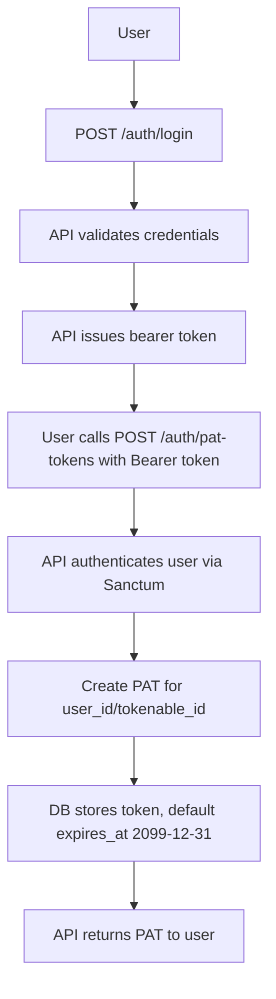

# Personal Access Token (PAT) Flow

This document describes how a user obtains a PAT and how it is stored.

## Flow Summary
1. User logs in with email and password.
2. API returns a bearer access token (short-lived user session token).
3. User calls the PAT creation endpoint with the bearer token.
4. API creates a PAT tied to the user and returns the new token.
5. The PAT is stored in the `personal_access_tokens` table with `tokenable_id` and `user_id`.
6. By default, `expires_at` is set to `2099-12-31 23:59:59` by the database.

## Endpoints
- `POST /auth/login` -> returns bearer token
- `POST /auth/pat-tokens` -> returns PAT token

## Flow Diagram

