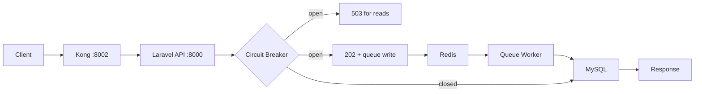
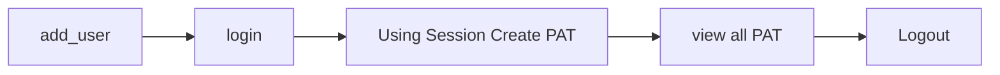

# Laravel User CRUD with MySQL and Kong

This project provides a complete CRUD API for a User resource using Laravel and MySQL, exposed through Kong API Gateway.

## Repository Branches
- [FastAPI-with-Kong](https://github.com/niketchandra/api-gateway-testing/tree/FastAPI-with-Kong) - FastAPI implementation
- [Laravel-with-Kong](https://github.com/niketchandra/api-gateway-testing/tree/Laravel-with-Kong) - Laravel implementation
- [Redis-Integration](https://github.com/niketchandra/api-gateway-testing/tree/Redis-Integration) - Redis caching layer integration

## Features

### ✨ System Management & Validation
- **System Registration**: Register systems/devices with PAT token authentication  
- **Validation Hash Support**: Track system validation via optional `validation_hash` field  
- **System Deregistration**: Change system status from `active` to `inactive` (deregister)
- **Query by User/Token**: List registered systems filtered by user or PAT token
- **Status Tracking**: Monitor active/inactive system states

### ✨ Configuration File Management
- **File Upload**: Upload configuration files with system and validation tracking
- **Validation Hash**: Track uploaded configs via `validation_hash` for verification
- **Filtered Listing**: List config files by `system_id` and `validation_hash`
- **Secure Download**: Download files by ID with `system_id` validation and PAT auth
- **Raw Data Access**: Retrieve stored file content from database
- **Soft Delete**: Mark files inactive while preserving data
- **Storage**: Files stored in `storage/app/private/config_files/{user_id}/` with UUID names
- **Database**: Metadata in `configuration_files`, content in `raw_data` table

### ✨ Resilience & High Availability
This project implements production-ready resilience patterns:

- **Circuit Breaker**: Automatically detects database failures and prevents cascading errors
- **Message Queue**: Buffers write operations when database is unavailable
- **Automatic Retry**: Failed operations retry with exponential backoff (30s, 60s, 120s, 300s, 600s)
- **Graceful Degradation**: Returns meaningful responses even when services are down

**How it works:**
1. When database fails 3 times, circuit breaker opens
2. Write operations are queued in Redis
3. Queue worker processes jobs when database recovers
4. Read operations return 503 with circuit state information

See [IMPLEMENTATION.md](IMPLEMENTATION.md) for complete guide and testing instructions.

## Docs
- Main README: [README.md](README.md)
- **API Documentation**: [API.md](API.md) - Complete API endpoint reference (Auth, Users, Products, PAT Tokens, System Registration, System Deregistration, Configuration Files, File Operations)
- Implementation Guide (Circuit Breaker + Queue): [IMPLEMENTATION.md](IMPLEMENTATION.md)
- Laravel API details: [LARAVEL.md](LARAVEL.md)
- Kong config and routing: [KONG.md](KONG.md)
- Resilience patterns (Circuit Breakers & Queues): [resilience.md](resilience.md)
- Circuit breaker details: [CircuitBreak.md](CircuitBreak.md)
- Queue system details: [QUEUE.md](QUEUE.md)
- Scenario notes: [scenerio.md](scenerio.md)
- Redis branch: https://github.com/niketchandra/api-gateway-testing/tree/Redis-Integration
- Redis docs (branch): https://github.com/niketchandra/api-gateway-testing/blob/Redis-Integration/redis.md
- Composer app README: [composer/README.md](composer/README.md)
- Copilot instructions: [.github/copilot-instructions.md](.github/copilot-instructions.md)

## End-to-end workflow (Laravel + Kong + MySQL + Redis + Circuit Breaker)
High-level flow for a typical request:

1. Client calls Kong (proxy port 8002).
2. Kong routes the request to the Laravel API service.
3. Laravel checks the circuit breaker state.
4. If breaker is closed, Laravel runs the DB call.
5. If the DB call fails, the breaker records failures and may open.
6. If breaker is open:
   - Reads return 503 with `circuit_state`.
   - Writes are queued in Redis and return 202.
7. Queue worker retries writes with backoff until MySQL is back.
8. On recovery, queued jobs succeed and the breaker closes after successful calls.

Workflow diagram:

```
Client
  |
  v
Kong (8002) -> Laravel API (8000) -> Circuit Breaker
                                     |          |
                                     |          +-- open --> 503 (read) / 202 + Redis queue (write)
                                     |
                                     +-- closed --> MySQL
                                                       |
                                                       +-- success -> response
                                                       +-- failure -> breaker counts failure
```



## Docker Compose (API + MySQL + Redis + Kong + Queue Worker)
1. Start everything:

```bash
docker compose -f docker-compose.yml -f docker-compose-kong.yml up -d
```

2. Build containers when code changes:

```bash
docker compose -f docker-compose.yml -f docker-compose-kong.yml up -d --build
```

3. Run migrations:

```bash
docker compose exec api php artisan migrate --force
```

4. Restart Kong after any kong/kong.yml change:

```bash
docker compose -f docker-compose.yml -f docker-compose-kong.yml restart kong
```

2. Services:
- **api**: Laravel application
- **mysql**: MySQL 8.0 database
- **redis**: Redis 7 for caching and queue
- **queue-worker**: Laravel queue worker for background jobs
- **kong**: Kong API Gateway 3.6
- **phpmyadmin**: Database admin interface

3. Endpoints:
- API (direct): http://localhost:8000
- Kong proxy: http://localhost:8002
- Kong admin: http://localhost:8001
- phpMyAdmin: http://localhost:8080 (user root, password empty)
- Redis: localhost:6379

The Laravel application lives in composer/ and is served by the api container.

## Kong API description
Kong runs in DB-less mode and loads kong/kong.yml at startup. The config defines:
- A users service with a /users route for all CRUD methods.
- An auth service with /auth/login and /auth/logout.
- A rate-limiting plugin on the users service.

Details: [KONG.md](KONG.md)

## CRUD commands (via Kong)
## File Storage Location

Configuration files uploaded via `/config-files/upload` are stored at:

**In Docker**: 
```
/app/storage/app/private/config_files/{user_id}/{uuid}.{extension}
```

**On Host Machine**:
```
composer/storage/app/private/config_files/{user_id}/{uuid}.{extension}
```

**Example**: 
- Docker: `/app/storage/app/private/config_files/3/8c399352-2c65-41e7-8480-4ac4d3200bc2.conf`
- Host: `composer/storage/app/private/config_files/3/8c399352-2c65-41e7-8480-4ac4d3200bc2.conf`

Files are also stored in the database:
- **Metadata**: `configuration_files` table (file_name, location, system_id, service_name, validation_hash, status)
- **Content**: `raw_data` table (file_data, validation_hash, status)

## API Endpoints Quick Reference

### Authentication (Session & PAT Tokens)
- `POST /auth/register` - Register new user
- `POST /auth/login` - Get session token
- `POST /auth/logout` - Logout user
- `GET /auth/validate-token` - Validate PAT via header
- `POST /auth/validate-token` - Validate PAT via body
- `POST /auth/pat-tokens` - Create new PAT token
- `GET /auth/pat-tokens` - List PAT tokens

### System Management (PAT Required)
- `POST /system-register` - Register system with optional validation_hash
- `GET /system-register` - List user's systems
- `GET /system-register/pat/{id}` - Get systems by PAT token
- `GET /system-register/user/{id}` - Get systems by user
- `POST /system-deregister` - Deregister system (change to inactive)

### Configuration File Management (PAT Required)
- `POST /config-files/upload` - Upload config file (system_id, service_name, validation_hash)
- `GET /config-files` - List all active configs
- `GET /config-files/filter?system_id=...&validation_hash=...` - Filter configs by system + hash
- `GET /config-files/{id}` - Download config file by ID
- `GET /config-files/download/{id}?system_id=...` - Download with system_id validation
- `GET /config-files/{id}/raw-data` - Get file content from database
- `DELETE /config-files/{id}` - Soft delete config (mark inactive)

### File Operations (PAT Required)
- `POST /files/upload` - Upload generic file
- `GET /files/{id}` - Download generic file

### User Management (Session Required)
- `GET /users` - List users
- `GET /users/{id}` - Get user by ID
- `POST /users` - Create user
- `PUT /users/{id}` - Update user
- `DELETE /users/{id}` - Delete user

These examples use a default test user. If it does not exist, create it first.

Default test credentials:
- Email: user001@example.com
- Password: Secret123!

Create user:

```bash
curl -X POST http://localhost:8002/users \
  -H "Content-Type: application/json" \
  -d "{\"name\":\"User001\",\"email\":\"user001@example.com\",\"password\":\"Secret123!\"}"
```

List users:

```bash
curl http://localhost:8002/users
```

Get user:

```bash
curl http://localhost:8002/users/1
```

Update user:

```bash
curl -X PUT http://localhost:8002/users/1 \
  -H "Content-Type: application/json" \
  -d "{\"name\":\"User001 Updated\"}"
```

Delete user:

```bash
curl -X DELETE http://localhost:8002/users/1
```

## Products CRUD (via Kong)
Create product:

```bash
curl -X POST http://localhost:8002/products \
  -H "Content-Type: application/json" \
  -d "{\"name\":\"Widget\",\"sku\":\"WID-001\",\"price_cents\":1200}"
```

List products:

```bash
curl http://localhost:8002/products
```

Get product:

```bash
curl http://localhost:8002/products/1
```

Update product:

```bash
curl -X PUT http://localhost:8002/products/1 \
  -H "Content-Type: application/json" \
  -d "{\"price_cents\":1500}"
```

Delete product:

```bash
curl -X DELETE http://localhost:8002/products/1
```

## Login and logout (via Kong)
Register:

```bash
curl -X POST http://localhost:8002/auth/register \
  -H "Content-Type: application/json" \
  -d "{\"name\":\"User001\",\"email\":\"user001@example.com\",\"password\":\"Secret123!\",\"password_confirmation\":\"Secret123!\"}"
```

Login (returns a temporary session token):

```bash
curl -X POST http://localhost:8002/auth/login \
  -H "Content-Type: application/json" \
  -d "{\"email\":\"user001@example.com\",\"password\":\"Secret123!\"}"
```

Retrieve session token from login response:

```bash
curl -s -X POST http://localhost:8002/auth/login \
  -H "Content-Type: application/json" \
  -d "{\"email\":\"user001@example.com\",\"password\":\"Secret123!\"}" | python -c "import sys, json; print(json.load(sys.stdin)['access_token'])"
```

Create PAT token (permanent, format atgla-xxxxxxxxxxxxxxxxxxx):

```bash
curl -X POST "http://localhost:8002/auth/pat-tokens?name=my_pat_1&expires_at=2099-12-31" \
  -H "Authorization: Bearer <session_token>"
```

View all PAT tokens for the current user:

```bash
curl -X GET http://localhost:8002/auth/pat-tokens \
  -H "Authorization: Bearer <session_token>"
```

Logout (invalidates the session token):

```bash
curl -X POST http://localhost:8002/auth/logout \
  -H "Authorization: Bearer <token>"
```

## File upload and download (via Kong)
Upload (requires PAT token):

```bash
curl -X POST http://localhost:8002/files/upload \
  -H "Authorization: Bearer <pat_token>" \
  -H "Content-Type: application/json" \
  -d "{\"file_name\":\"sample.txt\",\"file_data\":\"<raw-or-base64>\"}"
```

Download (requires PAT token, use file id from upload response):

```bash
curl -X GET http://localhost:8002/files/<file_id> \
  -H "Authorization: Bearer <pat_token>"
```

## System register (via Kong)
Register a system using a PAT token (CLI tool passes PAT only):

```bash
curl -X POST http://localhost:8002/system-register \
  -H "Authorization: Bearer <pat_token>" \
  -H "Content-Type: application/json" \
  -d "{\"system_name\":\"dev\",\"os_type\":\"Windows\",\"ip_address\":\"192.168.1.10\",\"org_id\":null,\"tags\":\"cli,dev\",\"metadata\":\"{\\\"cpu\\\":\\\"i7\\\"}\"}"
```

## Configuration File Management (via Kong)

### Upload Configuration File
Upload a config file with system_id, service_name, and optional validation_hash:

```bash
curl -X POST http://localhost:8002/config-files/upload \
  -H "Authorization: Bearer <pat_token>" \
  -F "file=@app.config" \
  -F "system_register_id=1093719686" \
  -F "service_name=myService" \
  -F "validation_hash=abc123def456"
```

### List All Configuration Files
List all active config files for authenticated user:

```bash
curl -X GET http://localhost:8002/config-files \
  -H "Authorization: Bearer <pat_token>"
```

### Filter Configuration Files
Filter config files by system_id and validation_hash:

```bash
curl -X GET "http://localhost:8002/config-files/filter?system_id=1093719686&validation_hash=abc123def456" \
  -H "Authorization: Bearer <pat_token>"
```

### Download Configuration File
Download a config file by ID (simple):

```bash
curl -X GET http://localhost:8002/config-files/12 \
  -H "Authorization: Bearer <pat_token>" \
  -o downloaded-app.config
```

### Download Configuration File by ID with System Validation
Download a config file by ID, requires system_id validation:

```bash
curl -X GET "http://localhost:8002/config-files/download/12?system_id=1093719686" \
  -H "Authorization: Bearer <pat_token>" \
  -o downloaded-app.config
```

### Get Raw File Data
Get stored file content from database:

```bash
curl -X GET http://localhost:8002/config-files/12/raw-data \
  -H "Authorization: Bearer <pat_token>"
```

### Delete (Soft Delete) Configuration File
Mark a config file as inactive:

```bash
curl -X DELETE http://localhost:8002/config-files/12 \
  -H "Authorization: Bearer <pat_token>"
```

### Deregister System
Change system status from active to inactive:

```bash
curl -X POST "http://localhost:8002/system-deregister?systemId=1093719686" \
  -H "Authorization: Bearer <pat_token>" \
  -H "Content-Type: application/json"
```

## Auth flow diagram (Session + PAT)



## Laravel migrations
Run migrations inside the api container:

```bash
docker compose exec api php artisan migrate --force
```

## Database tables (core)
- users: application users (name, email, password_hash, dob)
- personal_access_tokens: PAT tokens (user_id, token, abilities, expires_at, last_used_at)
- sessions: temporary session tokens for login (user_id, token, expires_at, last_used_at)
- system_register: registered systems (pat_token_id, user_id, org_id nullable, system_name, os_type, ip_address, tags, metadata)
- configuration_files: uploaded file metadata (user_id, file_name, file_location)
- raw_data: uploaded file contents (file_id, user_id, file_data)

## Database tables (updated with validation_hash)
- users: application users (id, name, email, password_hash, dob, status, created_at, updated_at)
- personal_access_tokens: PAT tokens (id, user_id, token, abilities, expires_at, last_used_at, created_at)
- sessions: temporary session tokens (id, user_id, token, expires_at, last_used_at, created_at)
- system_register: registered systems (id, pat_token_id, user_id, system_name, os_type, ip_address, org_id, tags, metadata, **validation_hash**, status, created_at, updated_at)
- configuration_files: uploaded file metadata (id, user_id, system_register_id, file_name, service_name, file_location, **validation_hash**, status, created_at, updated_at)
- raw_data: uploaded file contents (id, file_id, user_id, system_register_id, file_name, service_name, file_data, **validation_hash**, status, created_at, updated_at)

**Key Notes**:
- `validation_hash` (optional): Tracks validation status across system_register, configuration_files, and raw_data tables
- `status`: Tracks active/inactive state for systems and files
- Configuration files stored in both file system (`storage/app/private/config_files/{user_id}/`) and database

## Troubleshooting
- Kong says "no Route matched": restart Kong after editing kong/kong.yml.
  - docker compose -f docker-compose.yml -f docker-compose-kong.yml restart kong
- 500 error for "Unknown column users.password_hash": run the migration.
- Docker network not found: bring stack down and up again.
