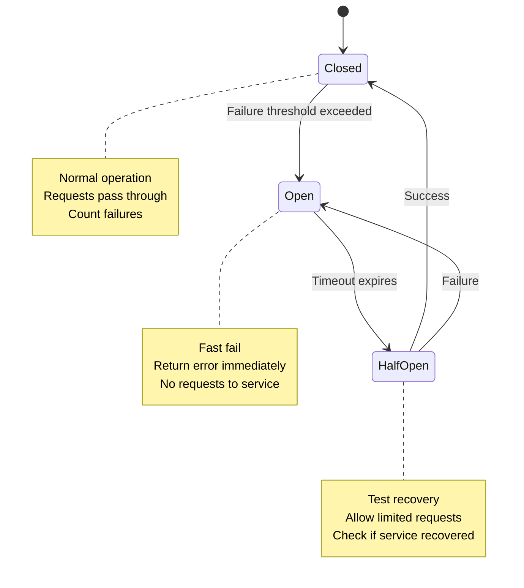
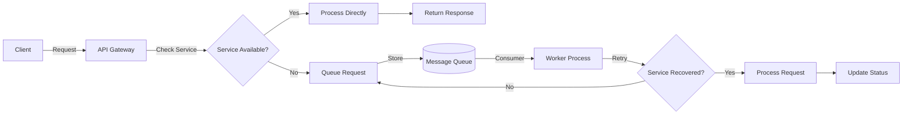
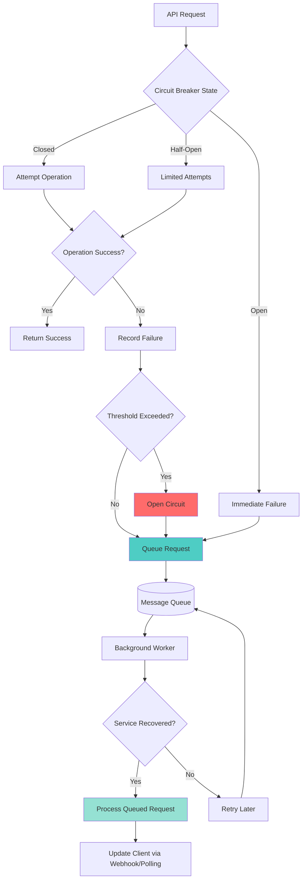
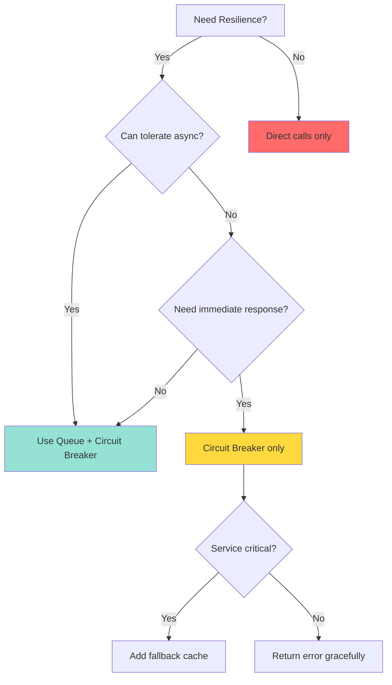

# Resilience Patterns: Circuit Breakers and Message Queues

This guide covers implementing resilience patterns to handle service failures (MinIO, S3, database downtime) in your API Gateway architecture.

## Table of Contents
1. [Circuit Breaker Pattern](#circuit-breaker-pattern)
2. [Message Queue Pattern](#message-queue-pattern)
3. [Combined Strategy](#combined-strategy)
4. [Implementation Examples](#implementation-examples)

---

## Circuit Breaker Pattern

### What is a Circuit Breaker?

A circuit breaker prevents your application from repeatedly trying to execute operations that are likely to fail, allowing the system to:
- Fail fast when a service is unavailable
- Prevent cascading failures
- Give failing services time to recover
- Provide fallback responses

### Circuit Breaker States



### Configuration Parameters

| Parameter | Description | Recommended Value |
|-----------|-------------|-------------------|
| **Failure Threshold** | Number of failures before opening circuit | 5 |
| **Timeout** | Time to wait before attempting recovery | 60 seconds |
| **Success Threshold** | Successes needed to close circuit (half-open) | 2 |
| **Monitoring Window** | Time window for counting failures | 120 seconds |

---

## Message Queue Pattern

### What is a Message Queue?

A message queue temporarily stores requests when downstream services are unavailable, enabling:
- Asynchronous processing
- Request buffering during outages
- Automatic retry with exponential backoff
- Decoupling of services

### Queue-Based Architecture



### Queue Options

| Queue Service | Use Case | Pros | Cons |
|---------------|----------|------|------|
| **Redis Queue** | Simple, fast buffering | Easy setup, in-memory speed | Limited persistence |
| **RabbitMQ** | Reliable message broker | Battle-tested, feature-rich | More complex setup |
| **AWS SQS** | Cloud-native AWS environments | Managed service, scalable | Vendor lock-in |
| **Bull/BullMQ** | Node.js/Redis queues | Great DX, dashboard | Requires Redis |

---

## Combined Strategy

### Request Flow with Circuit Breaker + Queue



---

## Implementation Examples

### FastAPI Implementation

#### 1. Install Dependencies

```bash
pip install pybreaker redis rq
```

#### 2. Circuit Breaker Setup

```python
# src/app/circuit_breaker.py
import pybreaker
import logging

logger = logging.getLogger(__name__)

# Circuit breaker for MinIO/S3
storage_breaker = pybreaker.CircuitBreaker(
    fail_max=5,
    timeout_duration=60,
    exclude=[FileNotFoundError],
    name="storage_circuit_breaker"
)

# Circuit breaker for database
db_breaker = pybreaker.CircuitBreaker(
    fail_max=3,
    timeout_duration=30,
    name="database_circuit_breaker"
)

# Listeners for monitoring
def log_circuit_open(cb, msg):
    logger.error(f"Circuit {cb.name} opened: {msg}")

def log_circuit_close(cb):
    logger.info(f"Circuit {cb.name} closed")

storage_breaker.add_listener(log_circuit_open, log_circuit_close)
db_breaker.add_listener(log_circuit_open, log_circuit_close)
```

#### 3. Protected Storage Operations

```python
# src/app/storage.py
from app.circuit_breaker import storage_breaker
from pybreaker import CircuitBreakerError
import boto3
from botocore.exceptions import ClientError

s3_client = boto3.client('s3')

@storage_breaker
def upload_to_s3(file_data: bytes, bucket: str, key: str):
    """Upload file with circuit breaker protection"""
    try:
        s3_client.put_object(Bucket=bucket, Key=key, Body=file_data)
        return {"status": "success", "key": key}
    except ClientError as e:
        # Circuit breaker will count this failure
        raise
    
@storage_breaker
def download_from_s3(bucket: str, key: str):
    """Download file with circuit breaker protection"""
    try:
        response = s3_client.get_object(Bucket=bucket, Key=key)
        return response['Body'].read()
    except ClientError as e:
        raise
```

#### 4. Queue Integration with RQ (Redis Queue)

```python
# src/app/queue.py
from redis import Redis
from rq import Queue
import logging

logger = logging.getLogger(__name__)

# Redis connection for queue
redis_conn = Redis(host='redis', port=6379, db=1)
file_queue = Queue('file_operations', connection=redis_conn)

def queue_file_upload(file_data: bytes, bucket: str, key: str, user_id: int):
    """Queue file upload for background processing"""
    job = file_queue.enqueue(
        'app.storage.upload_to_s3',
        file_data,
        bucket,
        key,
        job_timeout='5m',
        retry=True,
        meta={'user_id': user_id, 'operation': 'upload'}
    )
    logger.info(f"Queued upload job {job.id} for user {user_id}")
    return job.id

def queue_file_download(bucket: str, key: str, user_id: int):
    """Queue file download for background processing"""
    job = file_queue.enqueue(
        'app.storage.download_from_s3',
        bucket,
        key,
        job_timeout='5m',
        retry=True,
        meta={'user_id': user_id, 'operation': 'download'}
    )
    return job.id
```

#### 5. API Endpoint with Fallback

```python
# src/app/main.py
from fastapi import FastAPI, UploadFile, HTTPException
from pybreaker import CircuitBreakerError
from app.circuit_breaker import storage_breaker
from app.storage import upload_to_s3
from app.queue import queue_file_upload

app = FastAPI()

@app.post("/files/upload")
async def upload_file(file: UploadFile):
    file_data = await file.read()
    bucket = "my-bucket"
    key = f"uploads/{file.filename}"
    
    try:
        # Try direct upload with circuit breaker
        result = upload_to_s3(file_data, bucket, key)
        return {
            "status": "completed",
            "message": "File uploaded successfully",
            "key": result["key"]
        }
    
    except CircuitBreakerError:
        # Circuit is open - queue for later
        job_id = queue_file_upload(file_data, bucket, key, user_id=1)
        return {
            "status": "queued",
            "message": "Storage service unavailable. Request queued for processing.",
            "job_id": job_id,
            "check_status_url": f"/jobs/{job_id}/status"
        }
    
    except Exception as e:
        # Other errors - still queue
        job_id = queue_file_upload(file_data, bucket, key, user_id=1)
        return {
            "status": "queued",
            "message": "Upload failed. Request queued for retry.",
            "job_id": job_id
        }

@app.get("/jobs/{job_id}/status")
async def check_job_status(job_id: str):
    """Check status of queued job"""
    from rq.job import Job
    from app.queue import redis_conn
    
    try:
        job = Job.fetch(job_id, connection=redis_conn)
        return {
            "job_id": job_id,
            "status": job.get_status(),
            "result": job.result if job.is_finished else None,
            "error": str(job.exc_info) if job.is_failed else None
        }
    except Exception as e:
        raise HTTPException(status_code=404, detail="Job not found")
```

#### 6. Starting RQ Worker

```python
# worker.py
from redis import Redis
from rq import Worker, Queue

redis_conn = Redis(host='redis', port=6379, db=1)

if __name__ == '__main__':
    queue = Queue('file_operations', connection=redis_conn)
    worker = Worker([queue], connection=redis_conn)
    worker.work()
```

**Docker Compose addition:**

```yaml
# docker-compose.yml
  rq-worker:
    build: .
    command: python worker.py
    depends_on:
      - redis
    environment:
      - REDIS_HOST=redis
      - AWS_ACCESS_KEY_ID=${AWS_ACCESS_KEY_ID}
      - AWS_SECRET_ACCESS_KEY=${AWS_SECRET_ACCESS_KEY}
```

---

### Laravel Implementation

#### 1. Install Dependencies

```bash
composer require reshadman/file-secretary
composer require vladimir-yuldashev/laravel-queue-rabbitmq
```

#### 2. Circuit Breaker Setup

```php
// app/Services/CircuitBreaker.php
<?php

namespace App\Services;

use Illuminate\Support\Facades\Cache;
use Exception;

class CircuitBreaker
{
    private string $serviceName;
    private int $failureThreshold;
    private int $timeout;
    private int $successThreshold;

    public function __construct(
        string $serviceName,
        int $failureThreshold = 5,
        int $timeout = 60,
        int $successThreshold = 2
    ) {
        $this->serviceName = $serviceName;
        $this->failureThreshold = $failureThreshold;
        $this->timeout = $timeout;
        $this->successThreshold = $successThreshold;
    }

    private function getStateKey(): string
    {
        return "circuit_breaker:{$this->serviceName}:state";
    }

    private function getFailureCountKey(): string
    {
        return "circuit_breaker:{$this->serviceName}:failures";
    }

    private function getSuccessCountKey(): string
    {
        return "circuit_breaker:{$this->serviceName}:successes";
    }

    public function call(callable $callback)
    {
        $state = Cache::get($this->getStateKey(), 'closed');

        if ($state === 'open') {
            $openedAt = Cache::get("{$this->getStateKey()}:opened_at");
            if (time() - $openedAt > $this->timeout) {
                // Move to half-open
                Cache::put($this->getStateKey(), 'half-open', 300);
                Cache::put($this->getSuccessCountKey(), 0, 300);
            } else {
                throw new \Exception("Circuit breaker is open for {$this->serviceName}");
            }
        }

        try {
            $result = $callback();
            $this->onSuccess();
            return $result;
        } catch (Exception $e) {
            $this->onFailure();
            throw $e;
        }
    }

    private function onSuccess(): void
    {
        $state = Cache::get($this->getStateKey(), 'closed');

        if ($state === 'half-open') {
            $successes = Cache::increment($this->getSuccessCountKey());
            if ($successes >= $this->successThreshold) {
                // Close the circuit
                Cache::put($this->getStateKey(), 'closed', 300);
                Cache::forget($this->getFailureCountKey());
                Cache::forget($this->getSuccessCountKey());
                \Log::info("Circuit breaker closed for {$this->serviceName}");
            }
        } elseif ($state === 'closed') {
            // Reset failure count on success
            Cache::forget($this->getFailureCountKey());
        }
    }

    private function onFailure(): void
    {
        $failures = Cache::increment($this->getFailureCountKey());
        Cache::expire($this->getFailureCountKey(), 120); // 2 minute window

        if ($failures >= $this->failureThreshold) {
            // Open the circuit
            Cache::put($this->getStateKey(), 'open', $this->timeout + 60);
            Cache::put("{$this->getStateKey()}:opened_at", time(), $this->timeout + 60);
            \Log::error("Circuit breaker opened for {$this->serviceName}");
        }
    }

    public function isOpen(): bool
    {
        return Cache::get($this->getStateKey(), 'closed') === 'open';
    }
}
```

#### 3. Storage Service with Circuit Breaker

```php
// app/Services/FileStorageService.php
<?php

namespace App\Services;

use Illuminate\Support\Facades\Storage;
use Exception;

class FileStorageService
{
    private CircuitBreaker $circuitBreaker;

    public function __construct()
    {
        $this->circuitBreaker = new CircuitBreaker('s3_storage', 5, 60, 2);
    }

    public function uploadFile(string $path, $contents): string
    {
        return $this->circuitBreaker->call(function () use ($path, $contents) {
            // This will throw exception if S3 is down
            Storage::disk('s3')->put($path, $contents);
            return $path;
        });
    }

    public function downloadFile(string $path)
    {
        return $this->circuitBreaker->call(function () use ($path) {
            if (!Storage::disk('s3')->exists($path)) {
                throw new Exception("File not found");
            }
            return Storage::disk('s3')->get($path);
        });
    }

    public function isServiceAvailable(): bool
    {
        return !$this->circuitBreaker->isOpen();
    }
}
```

#### 4. Queue Job for File Upload

```php
// app/Jobs/ProcessFileUpload.php
<?php

namespace App\Jobs;

use App\Services\FileStorageService;
use Illuminate\Bus\Queueable;
use Illuminate\Contracts\Queue\ShouldQueue;
use Illuminate\Foundation\Bus\Dispatchable;
use Illuminate\Queue\InteractsWithQueue;
use Illuminate\Queue\SerializesModels;
use Illuminate\Support\Facades\Log;

class ProcessFileUpload implements ShouldQueue
{
    use Dispatchable, InteractsWithQueue, Queueable, SerializesModels;

    public $tries = 5;
    public $backoff = [60, 120, 300, 600, 1200]; // Exponential backoff in seconds

    private string $localPath;
    private string $remotePath;
    private int $userId;

    public function __construct(string $localPath, string $remotePath, int $userId)
    {
        $this->localPath = $localPath;
        $this->remotePath = $remotePath;
        $this->userId = $userId;
    }

    public function handle(FileStorageService $storageService): void
    {
        try {
            $contents = file_get_contents($this->localPath);
            $storageService->uploadFile($this->remotePath, $contents);
            
            Log::info("File uploaded successfully", [
                'user_id' => $this->userId,
                'path' => $this->remotePath
            ]);

            // Clean up local file
            if (file_exists($this->localPath)) {
                unlink($this->localPath);
            }

        } catch (\Exception $e) {
            Log::error("File upload failed", [
                'user_id' => $this->userId,
                'path' => $this->remotePath,
                'error' => $e->getMessage(),
                'attempt' => $this->attempts()
            ]);

            // Re-throw to trigger retry
            throw $e;
        }
    }

    public function failed(\Throwable $exception): void
    {
        Log::critical("File upload permanently failed after all retries", [
            'user_id' => $this->userId,
            'path' => $this->remotePath,
            'error' => $exception->getMessage()
        ]);

        // Notify user or admin
        // Could send email, webhook, etc.
    }
}
```

#### 5. Controller with Fallback

```php
// app/Http/Controllers/FileController.php
<?php

namespace App\Http\Controllers;

use App\Services\FileStorageService;
use App\Jobs\ProcessFileUpload;
use Illuminate\Http\Request;
use Illuminate\Support\Str;
use Illuminate\Support\Facades\Storage;

class FileController extends Controller
{
    private FileStorageService $storageService;

    public function __construct(FileStorageService $storageService)
    {
        $this->storageService = $storageService;
    }

    public function upload(Request $request)
    {
        $request->validate([
            'file' => 'required|file|max:10240', // 10MB
        ]);

        $file = $request->file('file');
        $fileName = Str::uuid() . '.' . $file->getClientOriginalExtension();
        $remotePath = "uploads/{$fileName}";

        // Check if circuit is open
        if (!$this->storageService->isServiceAvailable()) {
            return $this->queueUpload($file, $remotePath, $request->user()->id);
        }

        try {
            // Try direct upload
            $contents = file_get_contents($file->getRealPath());
            $this->storageService->uploadFile($remotePath, $contents);

            return response()->json([
                'status' => 'completed',
                'message' => 'File uploaded successfully',
                'file_name' => $fileName,
                'path' => $remotePath
            ]);

        } catch (\Exception $e) {
            // Circuit breaker triggered or other error - queue it
            return $this->queueUpload($file, $remotePath, $request->user()->id);
        }
    }

    private function queueUpload($file, string $remotePath, int $userId)
    {
        // Store file temporarily
        $tempPath = storage_path("app/temp/{$remotePath}");
        $file->move(dirname($tempPath), basename($tempPath));

        // Dispatch job
        $job = ProcessFileUpload::dispatch($tempPath, $remotePath, $userId);

        return response()->json([
            'status' => 'queued',
            'message' => 'Storage service unavailable. File queued for upload.',
            'job_id' => $job->id ?? null
        ], 202);
    }

    public function download(string $fileName)
    {
        $path = "uploads/{$fileName}";

        try {
            $contents = $this->storageService->downloadFile($path);
            return response($contents)
                ->header('Content-Type', 'application/octet-stream')
                ->header('Content-Disposition', "attachment; filename=\"{$fileName}\"");

        } catch (\Exception $e) {
            return response()->json([
                'error' => 'File not available. Service may be temporarily down.'
            ], 503);
        }
    }
}
```

#### 6. Queue Configuration

```php
// config/queue.php
'connections' => [
    'redis' => [
        'driver' => 'redis',
        'connection' => 'default',
        'queue' => env('REDIS_QUEUE', 'default'),
        'retry_after' => 90,
        'block_for' => null,
    ],
    
    'rabbitmq' => [
        'driver' => 'rabbitmq',
        'queue' => env('RABBITMQ_QUEUE', 'default'),
        'connection' => PhpAmqpLib\Connection\AMQPLazyConnection::class,
        'hosts' => [
            [
                'host' => env('RABBITMQ_HOST', '127.0.0.1'),
                'port' => env('RABBITMQ_PORT', 5672),
                'user' => env('RABBITMQ_USER', 'guest'),
                'password' => env('RABBITMQ_PASSWORD', 'guest'),
                'vhost' => env('RABBITMQ_VHOST', '/'),
            ],
        ],
        'options' => [
            'ssl_options' => [
                'cafile' => env('RABBITMQ_SSL_CAFILE', null),
                'local_cert' => env('RABBITMQ_SSL_LOCALCERT', null),
                'local_key' => env('RABBITMQ_SSL_LOCALKEY', null),
                'verify_peer' => env('RABBITMQ_SSL_VERIFY_PEER', true),
                'passphrase' => env('RABBITMQ_SSL_PASSPHRASE', null),
            ],
        ],
    ],
],
```

#### 7. Starting Queue Worker

```bash
# Start Laravel queue worker
php artisan queue:work redis --tries=5 --backoff=60,120,300
```

**Docker Compose addition:**

```yaml
# docker-compose.yml
  laravel-queue:
    build: ./composer
    working_dir: /var/www/html
    command: php artisan queue:work redis --tries=5 --backoff=60,120,300,600,1200
    depends_on:
      - redis
      - mysql
    environment:
      - DB_HOST=mysql
      - REDIS_HOST=redis
      - AWS_ACCESS_KEY_ID=${AWS_ACCESS_KEY_ID}
      - AWS_SECRET_ACCESS_KEY=${AWS_SECRET_ACCESS_KEY}
```

---

## Database Circuit Breaker

### FastAPI Example

```python
# src/app/db_circuit.py
from app.circuit_breaker import db_breaker
from sqlalchemy.orm import Session
from app.db import SessionLocal

@db_breaker
def get_db_with_breaker() -> Session:
    """Get database session with circuit breaker protection"""
    db = SessionLocal()
    try:
        # Test connection
        db.execute("SELECT 1")
        return db
    except Exception as e:
        db.close()
        raise
```

### Laravel Example

```php
// app/Services/DatabaseCircuitBreaker.php
<?php

namespace App\Services;

use Illuminate\Support\Facades\DB;

class DatabaseCircuitBreaker
{
    private CircuitBreaker $breaker;

    public function __construct()
    {
        $this->breaker = new CircuitBreaker('database', 3, 30, 2);
    }

    public function query(callable $callback)
    {
        return $this->breaker->call(function () use ($callback) {
            // Test connection first
            DB::select('SELECT 1');
            return $callback();
        });
    }
}
```

---

## Monitoring and Alerting

### Key Metrics to Track

1. **Circuit Breaker State Changes**
   - Log when circuits open/close
   - Alert on circuit open events
   - Track frequency of state changes

2. **Queue Depth**
   - Monitor queue size
   - Alert if queue grows beyond threshold
   - Track average processing time

3. **Retry Statistics**
   - Number of retries per job
   - Success rate after retries
   - Failed jobs after max retries

### Example Monitoring Setup

```python
# Prometheus metrics for FastAPI
from prometheus_client import Counter, Gauge, Histogram

circuit_state = Gauge('circuit_breaker_state', 'Circuit breaker state', ['service'])
circuit_failures = Counter('circuit_breaker_failures', 'Circuit breaker failures', ['service'])
queue_depth = Gauge('queue_depth', 'Number of jobs in queue', ['queue'])
job_processing_time = Histogram('job_processing_seconds', 'Job processing time', ['job_type'])
```

```php
// Laravel monitoring
use Illuminate\Support\Facades\Redis;

class CircuitBreakerMetrics
{
    public static function recordStateChange(string $service, string $state): void
    {
        Redis::publish('metrics', json_encode([
            'metric' => 'circuit_breaker_state',
            'service' => $service,
            'state' => $state,
            'timestamp' => time()
        ]));
    }

    public static function recordQueueDepth(string $queue, int $depth): void
    {
        Redis::set("metrics:queue_depth:{$queue}", $depth);
    }
}
```

---

## Best Practices

### 1. Failure Threshold Tuning
- Start conservative (5-10 failures)
- Adjust based on your service's normal error rate
- Consider different thresholds for different services

### 2. Timeout Configuration
- Storage services: 60-120 seconds
- Database queries: 30-60 seconds
- External APIs: 30-90 seconds

### 3. Queue Retention
- Set appropriate message TTL (Time To Live)
- Implement dead letter queues for permanently failed jobs
- Clean up old completed jobs regularly

### 4. Graceful Degradation
- Return cached data when possible
- Provide meaningful error messages to users
- Don't expose internal errors to end users

### 5. Testing
- Simulate service failures in staging
- Test circuit breaker state transitions
- Verify queue processing and retries
- Load test with circuits open

---

## Troubleshooting

### Circuit Breaker Not Opening

**Symptom:** Circuit stays closed despite repeated failures

**Solutions:**
- Verify failure threshold is set correctly
- Check if exceptions are being caught before reaching breaker
- Ensure monitoring window hasn't expired
- Review logs for state transitions

### Queue Not Processing

**Symptom:** Jobs stay in queue and aren't being processed

**Solutions:**
- Verify queue worker is running
- Check worker logs for errors
- Ensure Redis/RabbitMQ is accessible
- Verify job serialization is working

### High Queue Depth

**Symptom:** Queue grows faster than it's processed

**Solutions:**
- Scale up number of workers
- Optimize job processing time
- Implement job batching
- Add more queue consumers

### Jobs Failing After All Retries

**Symptom:** Jobs reach max retry limit and fail permanently

**Solutions:**
- Increase max retries or backoff duration
- Check if service is actually recovered
- Review job logic for bugs
- Implement better error handling

---

## Summary

| Pattern | When to Use | Pros | Cons |
|---------|-------------|------|------|
| **Circuit Breaker** | Protect against cascading failures | Fast fail, prevents overload | May reject valid requests |
| **Message Queue** | Handle temporary outages | Reliable delivery, decoupling | Added complexity, eventual consistency |
| **Combined** | Production environments | Best resilience | Most complex setup |

### Decision Tree



---

## Next Steps

1. Choose appropriate circuit breaker parameters for your services
2. Set up message queue infrastructure (Redis/RabbitMQ)
3. Implement circuit breakers for critical dependencies
4. Create queue jobs for async operations
5. Add monitoring and alerting
6. Test failure scenarios in staging
7. Document runbooks for common issues

For more information, see:
- [redis.md](redis.md) - Redis caching integration
- [KONG.md](KONG.md) - API Gateway configuration
- [README.md](README.md) - Project overview
